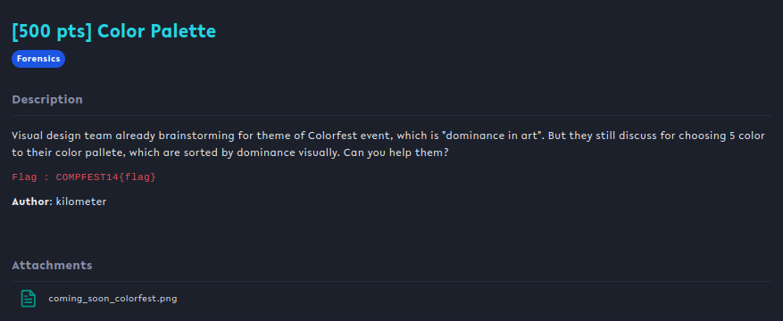
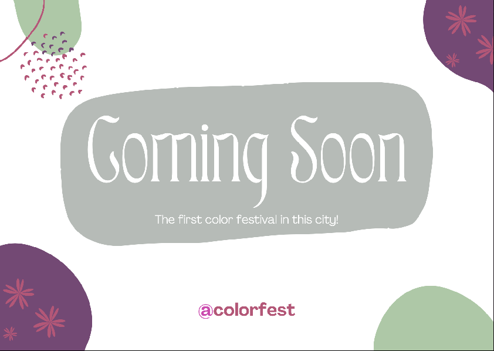
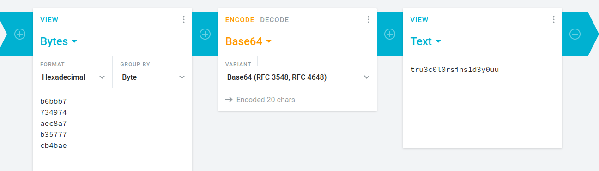

## Color Palette

## Overview & Description

Author : kilometer

Points : 500 pts

Visual design team already brainstorming for theme of Colorfest event, which is "dominance in art". But they still discuss for choosing 5 color to their color pallete, which are sorted by dominance visually. Can you help them?

Flag : COMPFEST14{flag}

[coming_soon_colorfest.png](https://ctf.compfest.id/files/5be182b1c90210eab2058542473761a2/coming_soon_colorfest.png?token=eyJ1c2VyX2lkIjo3NzMsInRlYW1faWQiOjQ4NiwiZmlsZV9pZCI6MTIzfQ.Y3Ts9A.KqhVSpZczlNiwpeGJ0P32YfFtYA)

## Hints

## Step by Step

Diberikan sebuah image yang berisikan design seperti berikut

Awalnya saya bingung harus ngapain, setelah meneliti deskripsi chall, ternyata kita harus mencari hex code warna yang "dominan" atau paling sering muncul, setelah menggunakan tool color identifier, berikut urutan hex nya (paling atas yang paling dominan) :

#b6bbb7
#734974
#aec8a7
#b35777
#cb4bae

Entah kenapa saya feeling kalau hex tersebut diubah ke base64 dengan menghilangkan simbol "#"

## Flag

**COMPFEST14{tru3c0l0rsins1d3y0uu}**