## c0rR3ct10n

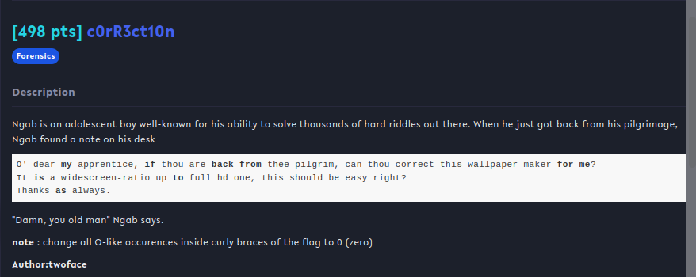

## Overview & Description

Author : twoface

Points : 498 pts

Ngab is an adolescent boy well-known for his ability to solve thousands of hard riddles out there. When he just got back from his pilgrimage, Ngab found a note on his desk

O' dear **my** apprentice, **if** thou are **back from** thee pilgrim, can thou correct this wallpaper maker **for me**? 
It **is** a widescreen-ratio up **to** full hd one, this should be easy right?
Thanks **as** always.

"Damn, you old man" Ngab says.

note : change all O-like occurences inside curly braces of the flag to 0 (zero)

[lemaoo.png](https://ctf.compfest.id/files/ed99cd75fd5e4923bc0cd08d18627182/lemaoo.png?token=eyJ1c2VyX2lkIjo3NzMsInRlYW1faWQiOjQ4NiwiZmlsZV9pZCI6MTIyfQ.Y3OAZA.6YR5jzIQPSVsoAfMKrKRCfKddR4)

## Hints


## Step by Step

Kita diberikan file foto yang bernama **lemaoo.png**. Ketika dibuka akan muncul error seperti dibawah

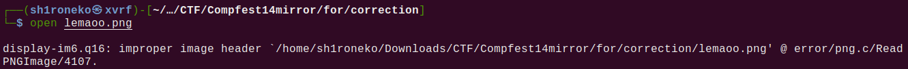

Dikatakan bahwa header image salah, kita coba liat melalui hex dump, dan ternyata benar. Header PNG salah dan sepertinya file tersebut telah di reverse

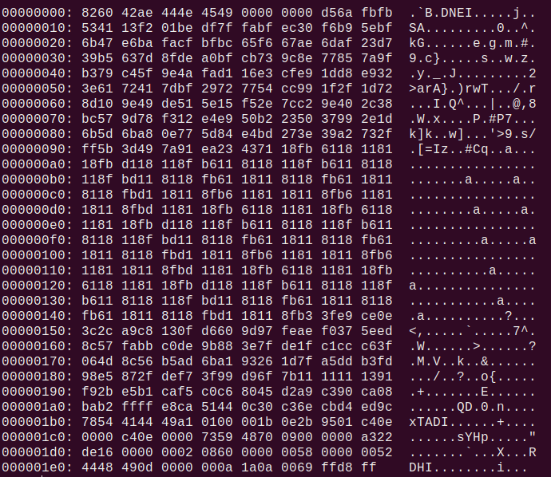

Agar foto bisa dibuka, tinggal kita kembalikan setiap bit yang dibalik dan membenarkan header foto tersebut

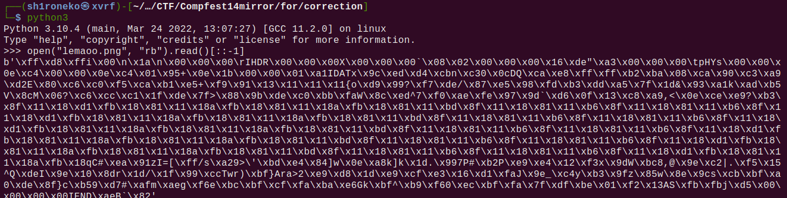

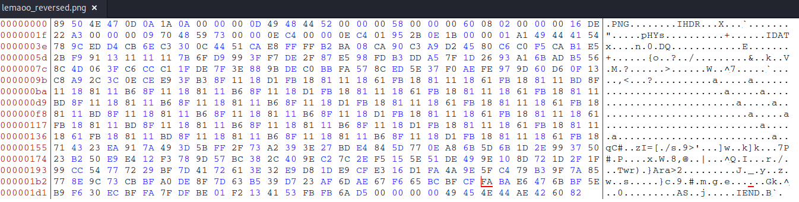

Dan setelah dibuka image tersebut bentuknya seperti ini

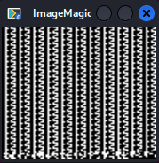

Setelah bingung mencari cara kemana2, tiba2 kepikiran untuk melakukan zsteg, dan setelah itu ditemukan ada sebuah link yang lagi-lagi di reverse

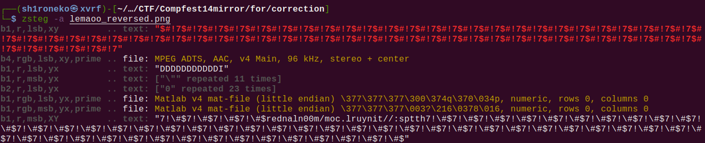

Setelah di reverse, didapatlah link yang mengarah ke google drive, link sebagai berikut https://tinyurl.com/m00nlander, setelah mendownload foto tersebut, saat coba dibuka, kita kembali mendapatkan error

File tersebut headernya salah, dan di chunk IEND terdapat string "flag", setelah mengganti header, menghapus string flag, dan mengubah ekstensi file tersebut menjadi PNG, karena hex didalamnya mirip seperti file PNG. Saat dibuka muncul error kembali

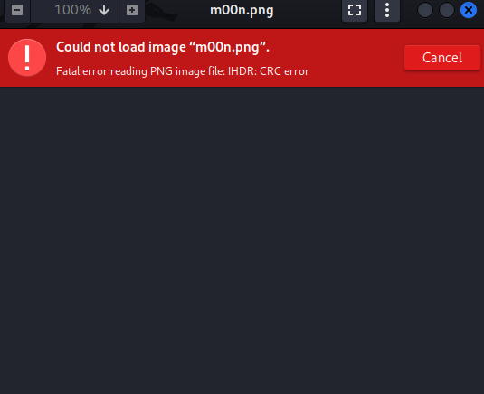

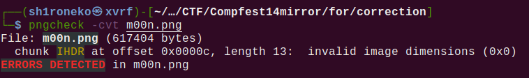

Melihat dari tools pngcheck, dimensi foto tersebut invalid, cara mengetahui dimensi yang benar adalah dengan mem-bruteforce value dimensi tersebut, untungnya saya menemukan write-up yang kurang lebih problemnya sama dan ada juga script untuk bruteforce dimensi foto. https://github.com/as3ng/RTLCTF/tree/main/Forensics/Manipulated

Full script:

```python
from binascii import crc32

crc_checksum = int.from_bytes(b'\xce\x13\xb2\x60',byteorder='big') #\xce\x13\xb2\x60

for h in range(0xffff):
   for w in range(0xffff):
   	    #IHDR Chunk + (4 Bytes Width) + (4 Bytes Height) + Bit Depth + Col Type + Compression Method + Filter Method + Interlace Method
   	    crc=b"\x49\x48\x44\x52"+w.to_bytes(4,byteorder='big')+h.to_bytes(4,byteorder='big')+b"\x08\x02\x00\x00\x00"
   	    if crc32(crc) % (1<<32) == crc_checksum:
   		    print('Image Width: ',end="")
   		    print(hex(w))
   		    print('Image Height :',end="")
   		    print(hex(h))
```

Setelah mencoba bruteforce, ditemukan bahwa dimensi foto yang benar adalah **0x3ba** yang dalam decimal adalah 954px dan **0x6a0** yang dalam decimal adalah 1696px

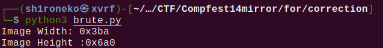

Namun saya pikir bahwa dimensi tersebut terbalik, yang seharusnya dimensi lebar lebih besar dari tinggi, mengingat deskripsi challenge yang disebutkan bahwa rasionya adalah widescreen

Setelah menemukan dimensi yang tepat, saatnya mengubah dimensi tersebut

Full script:

```python
from struct import pack

file = "m00n.png"

def change_size(width, height) -> bytes:
    with open(file, 'rb') as f:
        data = f.read()
        
    ihdr_ofset = data.find(b'IHDR')
    
    height = pack('>I', height)
    width = pack('>I', width)
    new_data = (height+width).join([data[:ihdr_ofset+4], data[ihdr_ofset+4+8:]])
    with open('new_'+file, 'wb') as f:
        f.write(new_data)
        
change_size(0x6a0, 0x3ba)
```

Setelah dilakukan penggantian dimensi, didapatkan foto baru dengan string flag dengan warna merah yang agak tidak terlihat

Jika ingin flag lebih terlihat, bisa menggunakan stegsolve dengan mode Green plane 1.

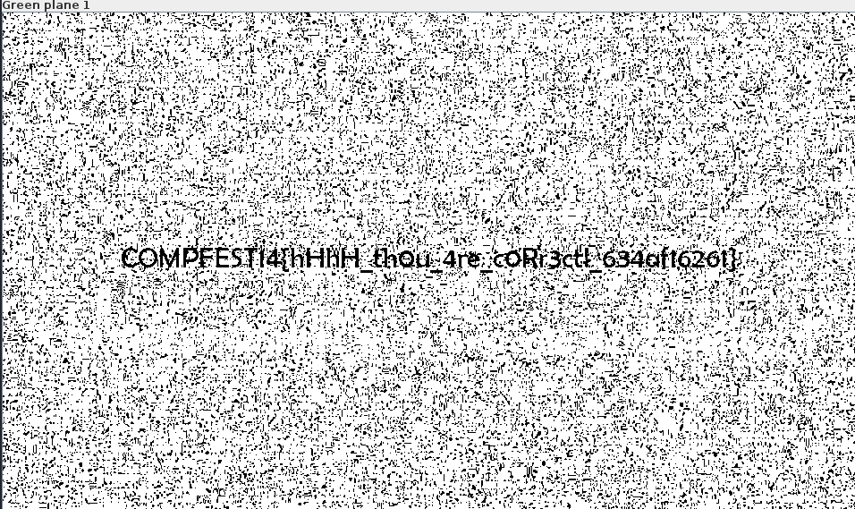

Perlu diingat bahwa sesuai deskripsi challenge, bahwa huruf *O* di flag, akan me representasikan angka *0*, jadi semua huruf O akan diganti dengan angka 0

## Flag

**COMPFEST14{hHhH_th0u_4re_c0rR3ect_634af16261}**
