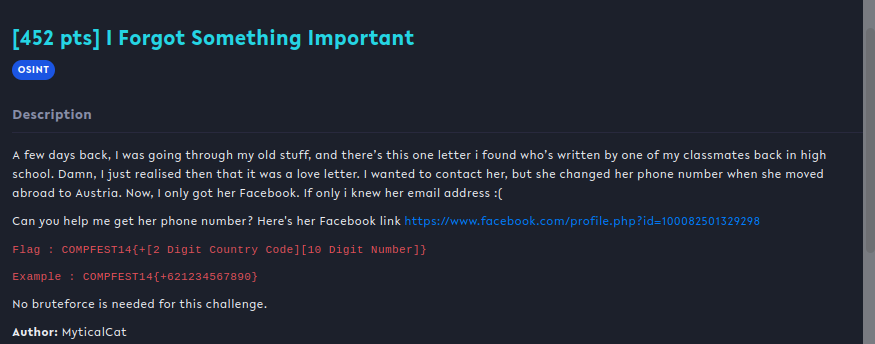
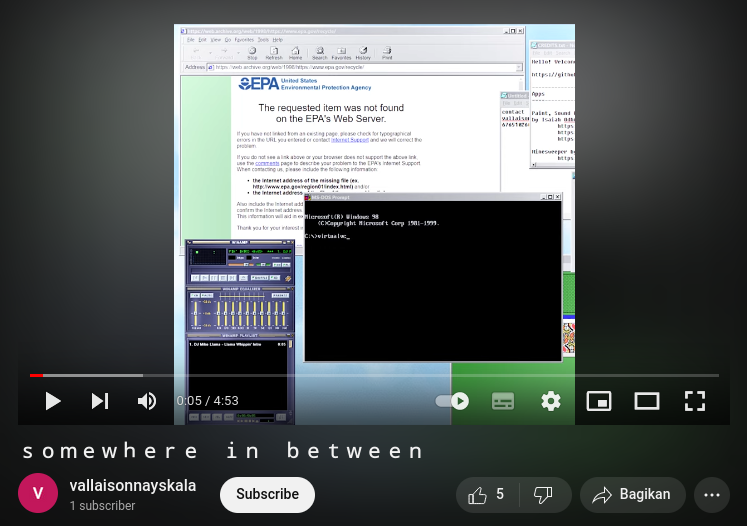
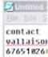
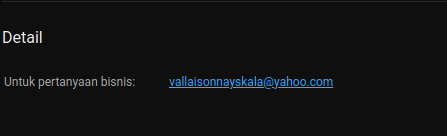
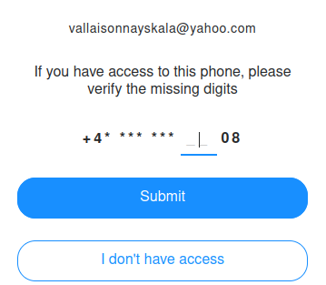

## I Forgot Something Important

## Overview & Description

Author : MyticalCat

Points : 452 pts

A few days back, I was going through my old stuff, and there’s this one letter i found who’s written by one of my classmates back in high school. Damn, I just realised then that it was a love letter. I wanted to contact her, but she changed her phone number when she moved abroad to Austria. Now, I only got her Facebook. If only i knew her email address :(

Can you help me get her phone number? Here's her Facebook link https://www.facebook.com/profile.php?id=100082501329298

Flag : COMPFEST14{+[2 Digit Country Code][10 Digit Number]}

Example : COMPFEST14{+621234567890}

No bruteforce is needed for this challenge.

## Hints

## Step by Step 

Diberikan sebuah link facebook yang mengarah ke profile yang bernama **Rozaliya Virtchelovek**

Setelah recon kesana kemari, tidak ada hasil yang didapat, saya berinisiatif untuk mencari di google berdasarkan username facebooknya, yaitu **vallaisonnayskala**

Setelah googling, ternyata ada sebuah akun youtube yang bernama sama, langsung saja cek, dan ada 1 video

Terdapat video berdurasi 4 menit 53 detik yang berisi sebuah screenshot dengan backsound yang aneh, namun jika dilihat lebih jeli lagi, didalam video tersebut ada sebuah potongan nomor handphone yang berjumlah 8 digit

Sepertinya itu nomor yang kita cari, tinggal 2 digit lagi. Setelah mencari kemana2, saya menemukan bahwa kita bisa melihat email akun tersebut, sesuai dengan deskripsi chall. Letak email tersebut ada di profile, lalu bagian tentang/about

Langsung saja kita ke yahoo.com, masukkan email tersebut lalu forgot username, akan muncul 2 digit terakhir nomor yang kita cari

Untuk susulan format flag sesuai deskripsi chall, yaitu COMPFEST14{2 digit nomor Austria + 10 digit nomor handphone}

## Flag

**COMPFEST14{+436765102608}**