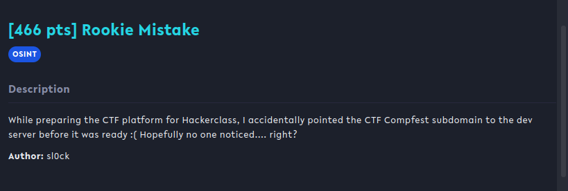
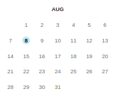
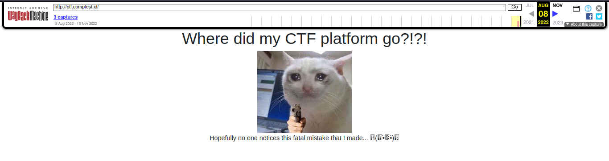
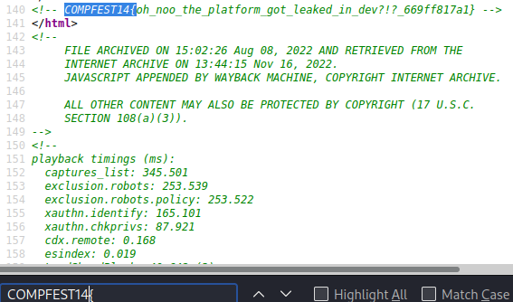

## Rookie Mistake

## Overview & Description

Author : sl0ck

Points : 466 pts

While preparing the CTF platform for Hackerclass, I accidentally pointed the CTF Compfest subdomain to the dev server before it was ready :( Hopefully no one noticed.... right?

## Hints

## Step by Step 

Soal yang cukup mudah, cukup mencari subdomain saat probset mengarahkannya pada dev server, tetap pada url CTF yaitu https://ctf.compfest.id, kita coba cari di [Wayback Machine](https://archive.org/web/)

Bisa dilihat, wayback machine menyimpan sebuah perubahan pada website di tanggal 8 Agustus 2022, berikut tampilan website

Karena tidak ada yang menarik, kita coba view source pada web tersebut, langsung saja search format flag yaitu **COMPFEST14{**

## Flag

**COMPFEST14{oh_noo_the_platform_got_leaked_in_dev?!?_669ff817a1}**