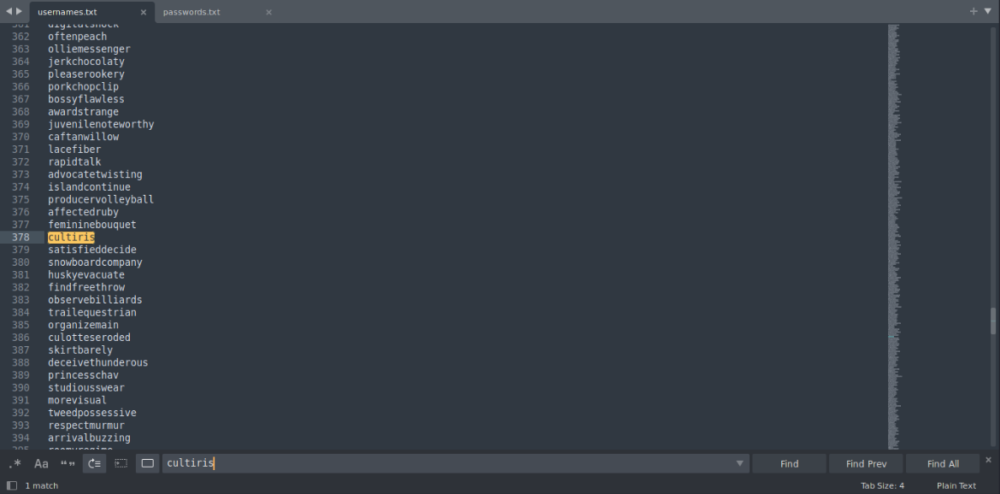
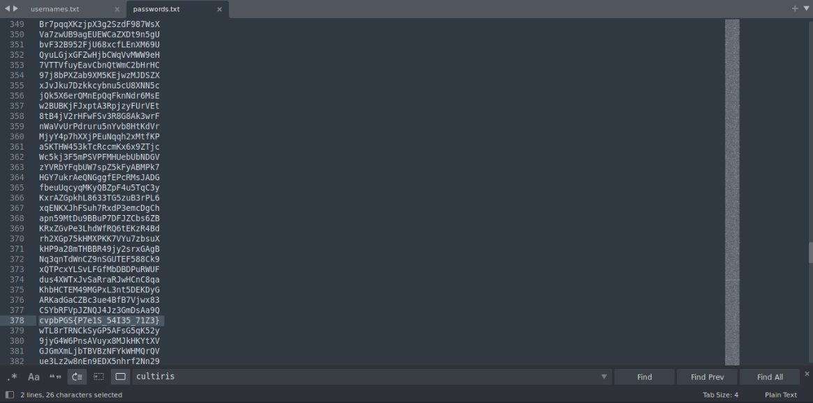
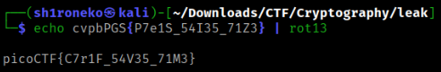

# credstuff


## Overview & Description

Category : Cryptography

Author : WILL HONG / LT 'SYREAL' JONES

Points : 100

We found a leak of a blackmarket website's login credentials. Can you find the password of the user cultiris and successfully decrypt it?
Download the [leak](https://artifacts.picoctf.net/c/534/leak.tar) here.
The first user in <span style="color:red">usernames.txt</span> corresponds to the first password in <span style="color:red">passwords.txt</span>. The second user corresponds to the second password, and so on.

## Hints

Maybe other passwords will have hints about the leak?

## Step by Step

Download the leak data, it has a .tar extension

Extract the leak data, and it will give you 2 text file, which is ``usernames.txt`` & ``passwords.txt``

Open the text file, ``i prefer using sublime text``

```bash
subl usernames.txt passwords.txt
```

Those are have a lot of usernames & passwords right? But remember....

Look again at the description of the problems

*"Can you find the password of the user cultiris and successfully decrypt it?"*

*"The second user corresponds to the second password, and so on."*

It gives us a very good hint, we can head over to ``usernames.txt`` and just press ``ALT + F`` and type ``cultiris`` (without ``" "``)



We found ``cultiris`` in line 378, if we look at the description which gives us hint, we can just head over to ``passwords.txt`` and scroll down into the line 378



It seems like a ROT13 encryption, if you don't know what it is, you can read this [documentation.](https://wiki.documentfoundation.org/Documentation/Calc_Functions/ROT13)

Very easy, we can go to terminal and use a command like this

```bash
echo cvpbPGS{P7e1S_54I35_71Z3} | rot13
```

To use ``rot13`` decoder tool, you must install it before

You can install it with this command 

```bash
apt-get install hxtools / sudo apt-get install hxtools (if you are not root user)
```

And here you go, we found the flag again!



## Flag

```text
picoCTF{C7r1F_54V35_71M3}
```


