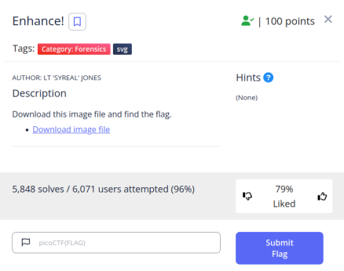
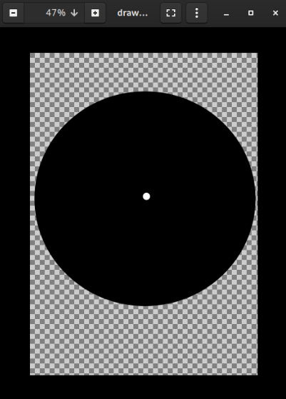
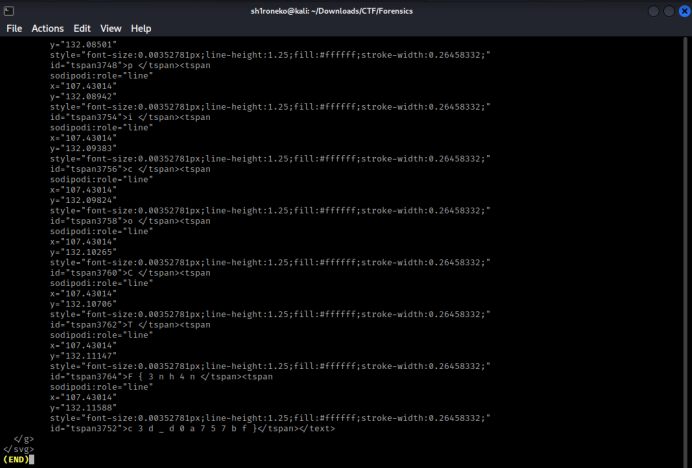
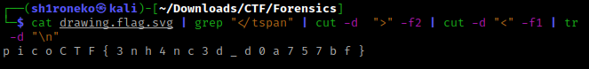
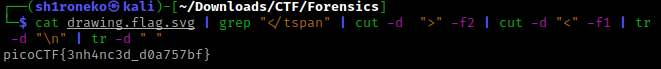

# Enhance!



## Overview & Description

Author : LT 'SYREAL' JONES

Points : 100 

Download this image file and find the flag: [Download image file](https://artifacts.picoctf.net/c/138/drawing.flag.svg)

## Hints

(None)

## Step by Step

First, download the image file, it has a .svg extension (Scalable Vector Graphics)

```bash
wget https://artifacts.picoctf.net/c/138/drawing.flag.svg
```

After the image has been downloaded, you can open it with ``eog`` command or whatever else to open the image file.

I have no idea what the image was, i zoom it and i haven't found anything related to the flag
vvVV


I use a bit of Forensics tools like ``exiftool`` & ``binwalk`` command, but it doesn't give me any clue.

Then i use ``strings`` command, and i scroll it into the last line....

And, *voilà*



I found the flag like that, you can write that 1 by 1, but i'm kinda lazy to do it

So i wrote a few command to combine the flag together

```bash
cat drawing.flag.svg | grep "</tspan" | cut -d ">" -f2 | cut -d "<" -f1 | tr -d "\n"
```




But the space distance was so annoying, so i add a few command like this to delete the spaces

```bash
cat drawing.flag.svg | grep "</tspan" | cut -d ">" -f2 | cut -d "<" -f1 | tr -d "\n" | tr -d " "
```

And yeah, i found the flag



## Flag

```text
picoCTF{3nh4nc3d_d0a757bf}
```


