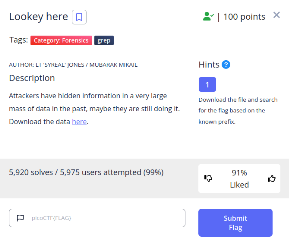
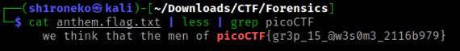

# Lookey Here



## Overview & Description

Category : ``Forensics`` ``grep``

Author : LT 'SYREAL' JONES / MUBARAK MIKAIL

Points : 100

Attackers have hidden information in a very large mass of data in the past, maybe they are still doing it.
Download the data [here.](https://artifacts.picoctf.net/c/296/anthem.flag.txt)

## Hints

Download the file and search for the flag based on the known prefix.

## Step by Step

First, download the flag data given in the Description above

```bash
wget https://artifacts.picoctf.net/c/296/anthem.flag.txt
```

Open the flag using ``cat`` command, it will give you a bunch of anthem lyrics

Remember to read the category of the problem, which is ``grep``

Grep is a command which you can use to find/grab the text you want

We can ``grep`` the flag format which is ``picoCTF``

And here you go, we found the flag !



## Flag

```text
picoCTF{gr3p15@w3s0m3_2116b979}
```

