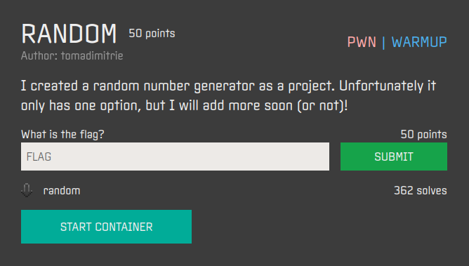
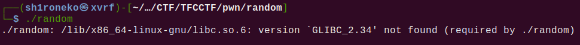
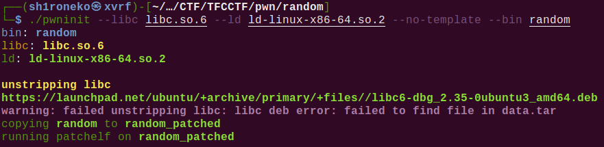
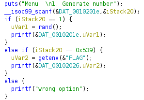

## Random



## Overview & Description

Author : tomadimitrie

Points : 50

I created a random number generator as a project. Unfortunately it only has one option, but I will add more soon (or not)! [random](https://ctf.thefewchosen.com/attachments/29d79696-82a3-4ca0-a600-801c10b3768f.main)

## Hints


## Step by Step

1. Diberikan sebuah file ELF bernama **random**, berikut rincian keamanan file tersebut dalam checksec


2. Namun saat program dijalankan, kita akan mendapatkan error, yaitu libc yang perlu digunakan adalah GLIBC versi 2.34



3. Untuk itu kita perlu mencari libc & loader nya, beruntung saja di challenge pwn lain, probset memberikan libc beserta loadernya, langsung saja kita patch menggunakan pwninit




4. Kita jalankan program yang sudah di patch dengan libc yang baru, ternyata program tersebut meminta kita memasukkan angka/menebak angka random yang akan keluar.
Hmmm... apakah challenge RNG (Random Number Generator)? tentu saja bukan

5. Coba kita decompile program tersebut dengan ghidra, lalu cek function main, disana kita akan mendapatkan bahwa jika user memasukkan input yang benar, maka program akan menjalankan "FLAG"



6. Function akan meng-execute "FLAG" menggunakan getenv(), jika kita memasukkan angka hex **0x539**, yang jika convert ke decimal akan bernilai **1337**

7. Langsung saja kita tes dengan remote server

```console
┌──(sh1roneko㉿xvrf)-[~/…/CTF/TFCCTF/pwn/random]
└─$ nc 01.linux.challenges.ctf.thefewchosen.com 49386
Menu: 
1. Generate number
1337
TFCCTF{Th3r3_w3r3_m0r3_0pt10n5_4ft3r_4ll!}
```


Flag didapatkan, namun tidak seru jika challenge pwn ga scripting, langsung saja kita buat scriptnya (meskipun ga ribet)

Full script :

```python
#!/usr/bin/env python3

from pwn import *

server = "01.linux.challenges.ctf.thefewchosen.com" 
port = 49386

io = remote(server, port)

io.recvuntil(b"Menu: ")
io.sendline(b"1337")

io.interactive() 
```

Output :

```console
┌──(sh1roneko㉿xvrf)-[~/…/CTF/TFCCTF/pwn/random]
└─$ python3 solver.py
[+] Opening connection to 01.linux.challenges.ctf.thefewchosen.com on port 49386: Done
[*] Switching to interactive mode
1. Generate number
TFCCTF{Th3r3_w3r3_m0r3_0pt10n5_4ft3r_4ll!}[*] Got EOF while reading in interactive
$ 
[*] Interrupted
[*] Closed connection to 01.linux.challenges.ctf.thefewchosen.com port 49386
```

## Flag

`TFCCTF{Th3r3_w3r3_m0r3_0pt10n5_4ft3r_4ll!}`
