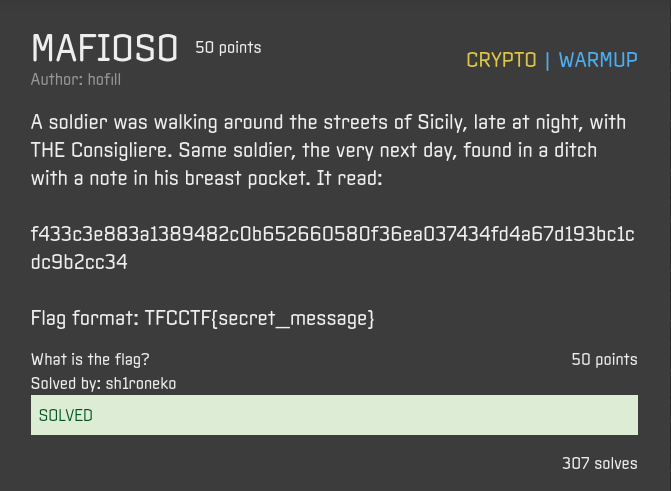
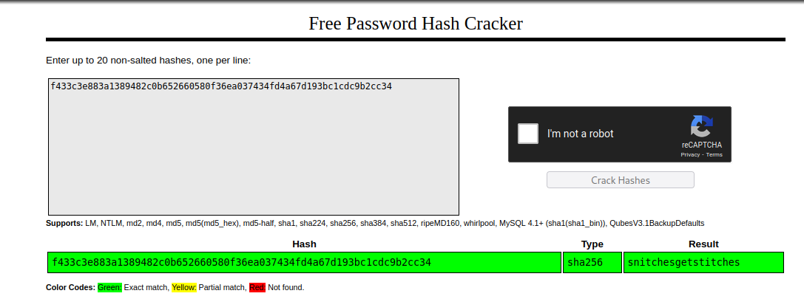

## MAFIOSO



## Overview & Description

Author : hofill

Points : 50

A soldier was walking around the streets of Sicily, late at night, with THE Consigliere. Same soldier, the very next day, found in a ditch with a note in his breast pocket. It read:

f433c3e883a1389482c0b652660580f36ea037434fd4a67d193bc1cdc9b2cc34

Flag format: TFCCTF{secret_message}


## Hints


## Step by Step

1. Diberikan sebuah string yang ada di deskripsi challenge, saat di cek dengan hashid, sepertinya ini adalah hash tipe SHA-256, langsung saja kita crack 

```console
┌──(sh1roneko㉿xvrf)-[~/Documents/CTF Writeup/TFCCTF 2022]
└─$ hashid f433c3e883a1389482c0b652660580f36ea037434fd4a67d193bc1cdc9b2cc34
Analyzing 'f433c3e883a1389482c0b652660580f36ea037434fd4a67d193bc1cdc9b2cc34'
[+] Snefru-256 
[+] SHA-256 
[+] RIPEMD-256 
[+] Haval-256 
[+] GOST R 34.11-94 
[+] GOST CryptoPro S-Box 
[+] SHA3-256 
[+] Skein-256 
[+] Skein-512(256)
``` 


2. Untuk website, saya memilih [crackstation.net](https://crackstation.net/)

3. Muncul lah string `snitchesgetstitches`, masukkan string tersebut kedalam format flag, yaitu TFCCTF{string}




## Flag

`TFCCTF{snitchesgetstitches}`