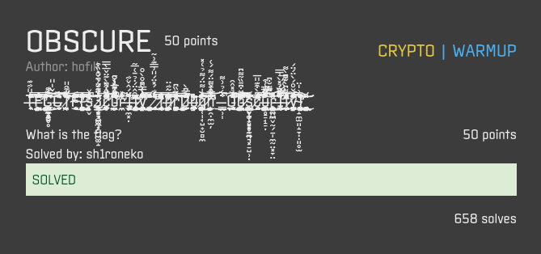
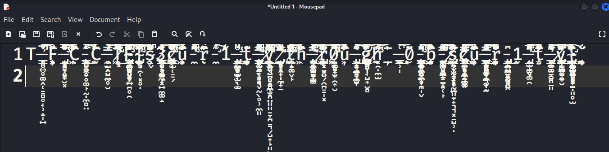
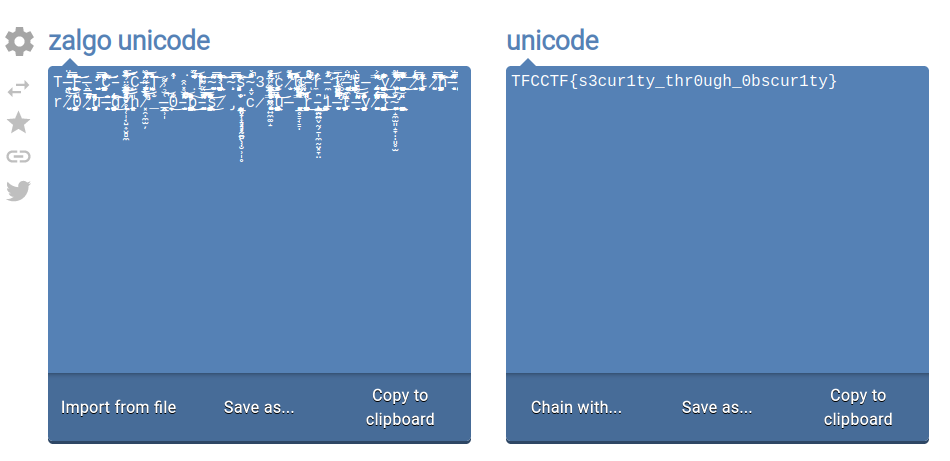

## OBSCURE

## Overview & Description

Author : hofill

Points : 50

## Hints

## Step by Step

1. Diberikan sebuah string aneh didalam deskripsi challenge, saya berasumsi bahwa text tersebut adalah [zalgo](https://en.wikipedia.org/wiki/Zalgo_text)

2. Challenge ini bisa di selesaikan melalui 2 cara, dengan melihat text ascii yang masih bisa terlihat dengan mata satu per satu, ataupun melalui website remove zalgo.

3. Cara pertama, yaitu dengan melihat text ascii satu per satu, taruh text kedalam notepad, lalu zoom sampai text terlihat agak jelas, ditemukan bahwa akan ada flag didalamnya

4. Cara kedua, yaitu melalui [website](https://onlineunicodetools.com/remove-zalgo-from-unicode)

5. Masukkan text zalgo, dan otomatis website akan men-decode text tersebut menjadi text ascii

## Flag

`TFCCTF{s3cur1ty_thr0ugh_0bscur1ty}`