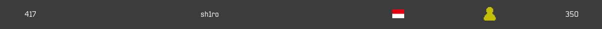

## The Few Chosen CTF 2022

Fri, 29 July 2022, 10:00 UTC — Sun, 31 July 2022, 10:00 UTC 

**On-line**

A TFC CTF event.

Format: Jeopardy

Official URL: [http://ctf.thefewchosen.com/](http://ctf.thefewchosen.com/)

**This event's future weight is subject of public voting!**

Rating weight: 24.27 

**Event organizers :**

 - [The Few Chosen](https://ctftime.org/team/140885)

Didalam CTF ini, saya meraih peringkat 417 dari 1282 tim, karena cuman bisa nyelesaiin challenge warmup - easy

Di semua chall pwn/binary exploit, saya menyelesaikannya setelah CTF berakhir, karena gatau cara patch libc & loader nya

anyway, enjoy.

## Binary Exploitation

- [random](https://github.com/AlfianReno/CTF-Writeup/tree/master/TFCCTF2022/Binary%20Exploitation/random)

- [winner](https://github.com/AlfianReno/CTF-Writeup/tree/master/TFCCTF2022/Binary%20Exploitation/winner)

## Cryptography

- [MAFIOSO](https://github.com/AlfianReno/CTF-Writeup/tree/master/TFCCTF2022/Cryptography/MAFIOSO)

- [OBSCURE](https://github.com/AlfianReno/CTF-Writeup/tree/master/TFCCTF2022/Cryptography/OBSCURE)

## Forensics

- [BBBBBBBBBB](https://github.com/AlfianReno/CTF-Writeup/tree/master/TFCCTF2022/Forensics/BBBBBBBBBB)

## Reverse Engineering

- [source](https://github.com/AlfianReno/CTF-Writeup/tree/master/TFCCTF2022/Reverse%20Engineering/source)

## Web Exploitation

- [Are You The Admin](https://github.com/AlfianReno/CTF-Writeup/tree/master/TFCCTF2022/Web%20Exploitation/Are%20You%20The%20Admin)

- [Deeplinks](https://github.com/AlfianReno/CTF-Writeup/tree/master/TFCCTF2022/Web%20Exploitation/Deeplinks)
