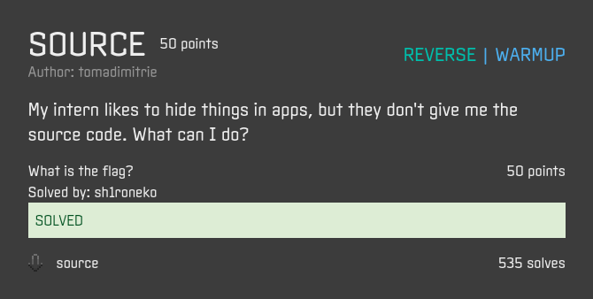
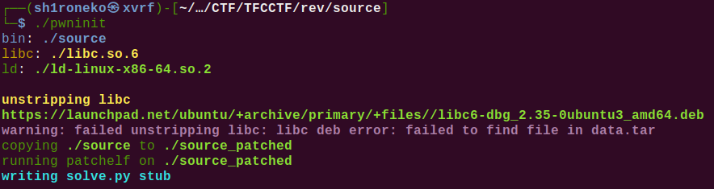
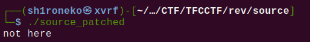
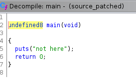
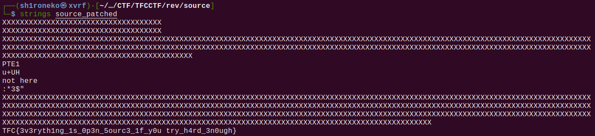

## Source

## Overview & Description

Author : tomadimitrie

Points : 50

My intern likes to hide things in apps, but they don't give me the source code. What can I do?

[source](https://ctf.thefewchosen.com/attachments/8ad0f928-2b76-4df9-b6e9-faf691e9ac54.main)

## Hints

## Step by Step

1. Diberikan sebuah file ELF lagi bernama **source**, seperti biasa program ini meminta kita untuk menggunakan libc 2.34, langsung saja kita patch menggunakan pwninit

2. Setelah dicoba, program cuman mengeluarkan output "not here"

3. Langsung saja kita disassemble menggunakan ghidra, saat di cek di function main, tidak ada satupun yang menarik

4. Saya coba melakukan command `strings` ke file ELF tersebut, dan ternyata flag ada didalamnya

## Flag

`TFC{3v3ryth1ng_1s_0p3n_5ourc3_1f_y0u try_h4rd_3n0ugh}`