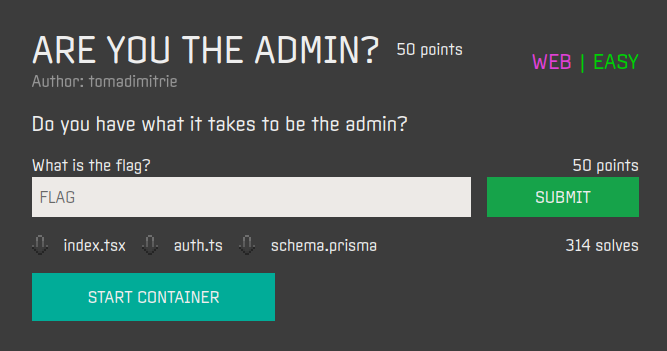
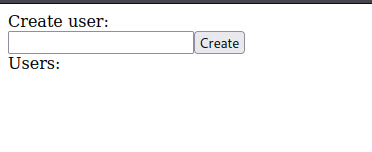
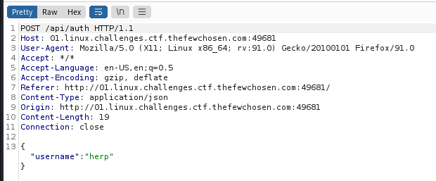
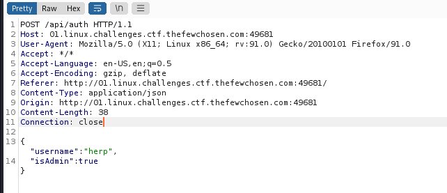
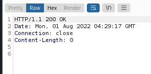
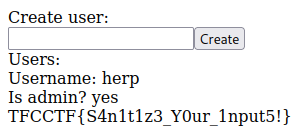

## Are You The Admin

## Overview & Description

Author : tomadimitrie

Points : 50

Do you have what it takes to be the admin?

[index.tsx](https://ctf.thefewchosen.com/attachments/d4266d69-cac4-48fd-8d37-24a58cd0fb94.tsx)
[auth.ts](https://ctf.thefewchosen.com/attachments/69d1d9a4-04bb-4a49-800c-f506adcb1686.ts)
[schema.prisma](https://ctf.thefewchosen.com/attachments/71b580a8-e9a4-4745-b65e-0d02835e7270.prisma)

## Hints

## Step by Step

1. Diberikan sebuah index web menggunakan typescript, auth.js, prisma, dan juga link website, saat dibuka isinya hanya input user

2. Didalam index.tsx, terdapat function yang dimana jika variable isAdmin = true, maka web akan memberikan output berupa flag

3. Kita coba jalankan web, mendaftar dengan nama terserah, lalu saat menekan button create, kita intercept menggunakan burpsuite

4. Disana terlihat bahwa response web akan terdapat sebuah JSON yang isinya

    {
        "username":"herp"
    }

5. Disini lah letak celahnya, tinggal kita tambahkan saja didalam JSON yaitu

    {
        "username":"herp",
        "isAdmin":true
    }

6. Tidak ada error dalam response, lalu kita balik ke website dan refresh, dan didapati flag

## Flag

`TFCCTF{S4n1t1z3_Y0ur_1nput5!}`
