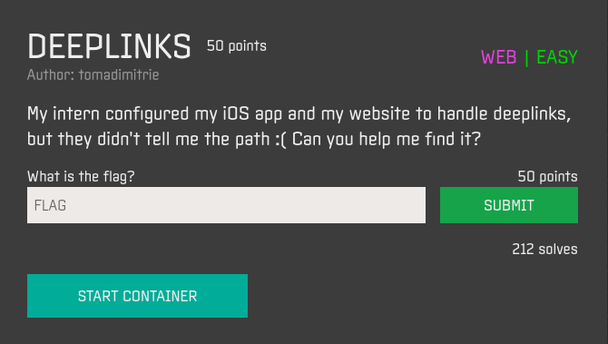
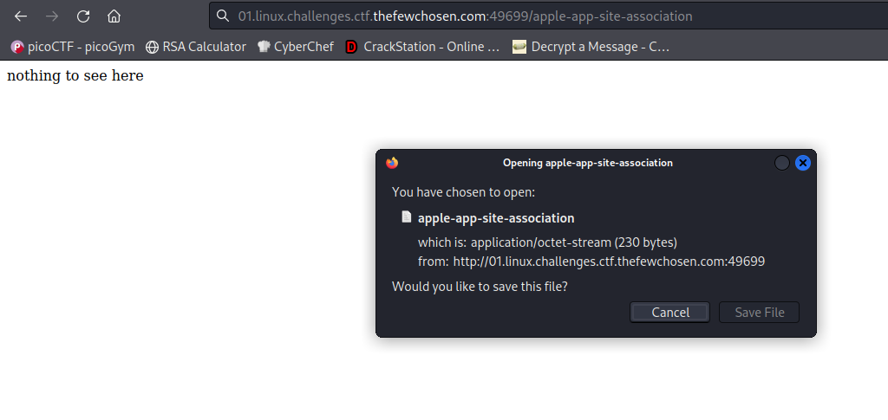
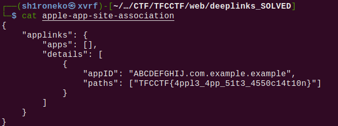

## Deeplinks

## Overview & Description

Author : tomadimitrie

Points : 50

My intern configured my iOS app and my website to handle deeplinks, but they didn't tell me the path :( Can you help me find it?

## Hints

## Step by Step

1. Diberikan sebuah link website, didalam deskripsi chall diketahui bahwa kita harus mencari letak path links website tersebut

2. Disini saya mencari2 cara untuk mengetahui cara masuk ke path tersebut, lalu menemukan artikel berikut
https://abhimuralidharan.medium.com/universal-links-in-ios-79c4ee038272

3. Dan diketahui bahwa untuk menemukan path tersebut, tinggal tambahkan saja url /apple-app-site-association

4. Saat menambahkan url tersebut, download file apple-app-site-association yang berisi JSON

5. Saat dibuka, isinya terdapat flag didalamnya

## Flag

`TFCCTF{4ppl3_4pp_51t3_4550c14t10n}`
